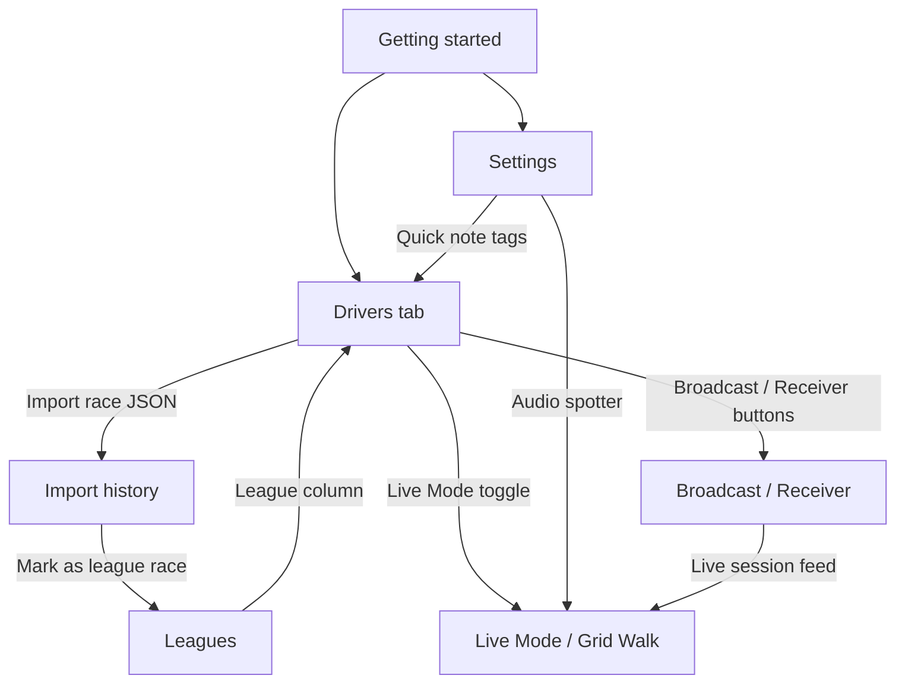

# GridNotes user guide

Welcome to the GridNotes wiki — a page-by-page guide to every feature in the app and how the pieces fit together.

GridNotes is a desktop scouting book for iRacing. It keeps your driver notes, race history, Safety Index scores, and league rosters on your PC in a local database. No cloud account is required.

---

## Start here

| Guide | What you'll learn |
|-------|-------------------|
| **[Getting started](getting-started.md)** | First launch, main layout, typical workflows, and how the tabs relate |
| **[Keyboard shortcuts](keyboard-shortcuts.md)** | Quick keys for search, Live Mode, and saving notes |

---

## Main tabs

Each tab has its own detailed guide:

| Tab | Guide |
|-----|-------|
| **Drivers** | **[Drivers tab](drivers-tab.md)** — table, filters, driver details, import, Safety Index |
| **Import history** | **[Import history](import-history.md)** — session list, search, league race tagging |
| **Leagues** | **[Leagues](leagues.md)** — leagues, seasons, rosters, bulk add |
| **Settings** | **[Settings](settings.md)** — appearance, data, backups, updates, legal |

---

## Live scouting views

These live inside the **Drivers** tab when iRacing is connected:

| View | Guide |
|------|-------|
| **Live Mode** | **[Live Mode](live-mode.md)** — high-contrast driver cards for in-race scouting |
| **Grid Walk** | **[Live Mode → Grid Walk](live-mode.md#grid-walk)** — starting-grid layout before the green flag |

---

## Multi-device scouting

| Topic | Guide |
|-------|-------|
| **Broadcast & Receiver** | **[Broadcast and receiver](broadcast-and-receiver.md)** — share your book and live session over LAN |

---

## How the pages connect

---

## Related docs (developers)

- [Release notes](../RELEASE_NOTES.md) — version history
- [Install guide](../../INSTALL.md) — download and setup
- [Code structure](../CODE_STRUCTURE.md) — for contributors

---

**Tip:** Open the in-app **Scouting guide** from the Drivers tab (**Scouting guide…** button) or Settings → **Scouting guide…** for a quick reference to Safety Index colors and marks while you race.
