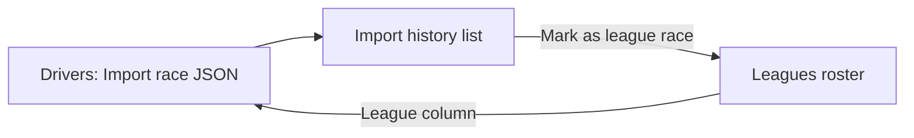

# Import history

**See also:** [Wiki home](README.md) · [Drivers tab](drivers-tab.md) · [Leagues](leagues.md) · [Getting started](getting-started.md)

The **Import history** tab lists every iRacing subsession you have imported into your scouting book. Use it to check whether a race is already recorded and to tag sessions as league races.

---

## What you see

A searchable, paginated table of imported sessions.

### Columns

| Column | Content |
|--------|---------|
| **Session ID** | iRacing subsession ID |
| **Session** | Series or event name from the import |
| **League** | `{League name} · {Season name}` if tagged, otherwise **—** |
| **Imported** | When the JSON was imported (uses your [display timezone](settings.md#timezone)) |

Hover a row for a tooltip with session ID, name, driver count, and league info.

### Status messages

| Message | Meaning |
|---------|---------|
| **No imported sessions yet. Use Import race JSON on the Drivers tab.** | Nothing imported yet — start on [Drivers tab](drivers-tab.md) |
| **Filtered by session ID "…".** | Search is active |
| **N imported session(s) in your book.** | Normal list view |

---

## Controls

| Control | What it does |
|---------|--------------|
| **Search** | Filter by subsession ID. Partial matches work across your full history (not just the current page). |
| **Mark as league race…** | Tag the selected session as a league race and add its drivers to a season roster. Opens a dialog — see below. |
| **Clear league tag** | Remove league association from the selected session. Enabled only when the row has a league tag. |

### Pagination

Same controls as the Drivers tab: **Rows per page** (25 / 50 / 100 / 200), **Previous**, **Next**. Item label shows **sessions**.

---

## Mark as league race dialog

**Title:** Mark as league race

| Field | Description |
|-------|-------------|
| **League** | Pick an existing league (create one on [Leagues tab](leagues.md) first) |
| **Season** | Pick a season within that league |

Click **OK** to:

1. Associate the subsession with that league and season
2. **Automatically add all drivers from that import** to the season roster
3. Update the **League** column on the [Drivers tab](drivers-tab.md) for those drivers

If you have no leagues or seasons yet, the dialog prompts you to create them on the **Leagues** tab.

After success, status may show:

> Subsession {id} marked as a league race. Added N driver(s) to the season roster.

---

## Typical workflows

### Check before importing again

1. Open **Import history**
2. Search for the subsession ID (from iRacing or your JSON file)
3. If found, you already have that race — re-importing won't duplicate results but is unnecessary

### Tag a league race after import

1. Import JSON on [Drivers tab](drivers-tab.md)
2. Open **Import history**
3. Select the session row
4. Click **Mark as league race…**
5. Choose league and season → **OK**

Alternatively, use **Add current session** on the [Leagues tab](leagues.md) while still in iRacing — no import required for the roster add.

### Remove a mistaken league tag

1. Select the session
2. Click **Clear league tag**

This removes the league race association but does **not** remove drivers from the season roster automatically.

---

## Connections

| Related page | Link |
|--------------|------|
| Import files | [Drivers tab → Import race JSON](drivers-tab.md#import-race-json) |
| Manage rosters | [Leagues tab](leagues.md) |
| League badges in live view | [Live Mode](live-mode.md) |

[← Wiki home](README.md) · [Leagues →](leagues.md)
